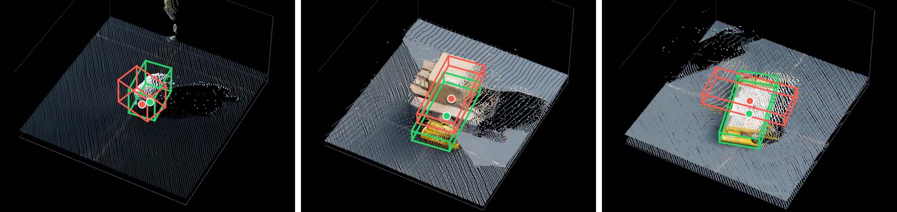
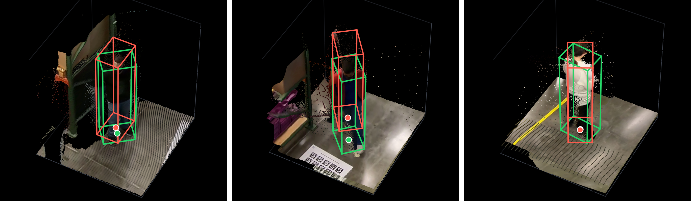
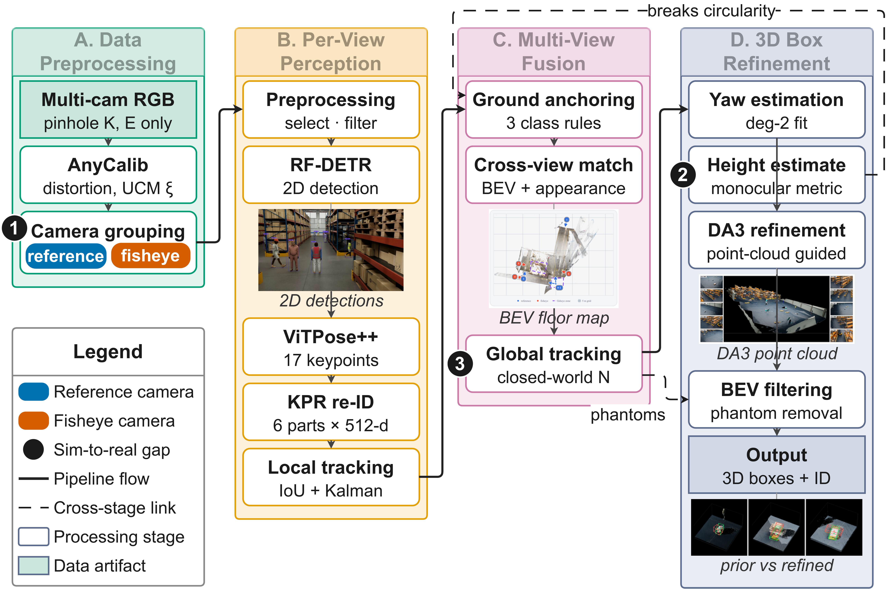

<h1 align='center'>
    Syn2RealTrack: Bridging the Gap Between Synthetic and Real-World Datasets<br>
    for Online Multi-View Multi-Target Tracking
</h1>

<div align='center'>
    <a href="https://scholar.google.com/citations?user=crRQGUAAAAAJ&hl">
      Duong Nguyen-Ngoc Tran</a> &emsp;
    <a href="https://scholar.google.com/citations?user=pCTUkWwAAAAJ">
      Ngoc Doan-Minh Huynh</a> &emsp;
    <a href="https://scholar.google.com/citations?user=Cvf5w60AAAAJ&hl">
      Cu Quoc Le</a> &emsp;
    <a href="https://scholar.google.com/citations?user=YpOO60MAAAAJ">
      Hoang Khang Nguyen</a> &emsp;
</div>

<div align='center'>
    Long Hoang Pham &emsp;
    Quoc Pham-Nam Ho &emsp;
    Huy-Hung Nguyen &emsp;
</div>

<div align='center'>
    Hyung-Min Jeon &emsp;
    Chi Dai Tran &emsp;
    Son Hong Phan
</div>

<div align='center'>
    Duong Khac Vu &emsp;
    Trinh Le Ba Khanh &emsp;
    <a href="https://scholar.google.com/citations?user=9z0SfKoAAAAJ">
        Jae Wook Jeon</a>
</div>

<!-- affiliation -->
<div align='center'>
    <br>
    Solution for Track 01, AI City Challenge 2026, Team SKKU-AL-T1, ID 34
    <br>
    <a href="https://micro.skku.ac.kr/micro/index.do">Automation Lab</a>
    <p>Sungkyunkwan University</p>
</div>

<div align='center'>
    <b>Contacts:</b> <a href="mailto:duongtran@skku.edu">duongtran@skku.edu</a> , <a href="mailto:jwjeon@skku.edu">jwjeon@skku.edu</a>
</div>

<br>
<div align='center'>
    <a href="https://github.com/SKKUAutoLab/aic26_mc3dp">
      </a>
    <a href="LICENSE">
      </a>
</div>

## I. NEWS

- [2026.08.05] 💻 Our code is released!
- [2026.08.02] 📄 Our paper is accepted at ECCVW.
- [2026.07.24] 📄 Our paper is under review.

<p align="center">
  
  
</p>

*Point-cloud-guided 3D box refinement on (top) a synthetic and (bottom) a real-world scene of the AI City Challenge 2026 Track 1 dataset: red boxes denote the original multi-view tracking prior, green boxes the refined 3D boxes, and the colored points the local cloud reconstructed by Depth Anything 3 (DA3).*

## II. Overview

Multi-camera 3D perception systems for warehouses are trained largely on synthetic data but evaluated in physically captured environments, where mismatched lens distortion, object dimensions, and object counts corrupt ground-plane localization and cross-camera identity association. Syn2RealTrack is an online multi-view multi-target tracking pipeline that treats this synthetic-to-real gap not as one deficiency but as three separable ones — the camera calibration, the object shape prior, and the assumption that the object census is known — and applies a different local remedy to each. Rather than retraining a feature extractor for domain adaptation, the system adapts by reallocating trust between geometry and appearance, reaching 52.0118% 3D HOTA and second place on the AI City Challenge 2026 Track 1 evaluation server.

## III. Highlights

- **Distortion-aware grouping** — AnyCalib recovers the lens distortion the calibration omits; the Unified Camera Model parameter $\xi$ splits reference from fisheye views.
- **Fusion that abstains** — visibility-weighted part similarity excludes parts occluded in either view instead of imputing them; adds 0.06 HOTA.
- **Measured person height** — a closed-form estimate from calibration and ankle ground points replaces the synthetic height prior, without depth or extra supervision.
- **Contained closed-world prior** — exact per-class counts apply only in suitable closed-world scenes; a causal ankle-visibility filter removes the phantom boxes they manufacture.

## IV. Method

<p align="center"></p>

*Overview of the proposed framework, read left to right.*

**(A)** AnyCalib estimates per-camera distortion from 31 sampled frames, and the Unified Camera Model parameter $\xi$ separates reference ($\xi \le 0.3$) from fisheye-candidate views. **(B)** RF-DETR, ViTPose++, and Keypoint Promptable Re-Identification (KPR) provide detections, keypoints, and visibility-aware part descriptors, which an appearance–IoU Kalman tracker links into local identities. **(C)** Class-specific ground anchors and visibility-weighted part similarity merge observations within per-class bird's-eye-view (BEV) gates, and local-identity carry-forward plus gated Hungarian assignment form global tracks; **(D)** trajectory-derived yaw, monocular person height, DA3-guided footprint and yaw refinement, and BEV visibility filtering produce the final boxes.

## V. Results

Leaderboard of Multi-Camera 3D Perception, AI City Challenge 2026 Track 1, ranked by 3D HOTA (%).

| Rank | ID | Name | 3D HOTA (%) | DetA (%) | AssA (%) | LocA (%) |
| :--- | :--- | :--- | :--- | :--- | :--- | :--- |
| 1 | 289 | EVA | 56.5447 | 55.6444 | 49.3929 | 79.5558 |
| **2** | **34** | **SKKU-AL-T1 (ours)** | **52.0118** | **45.3056** | **56.5047** | **76.2410** |
| 3 | 130 | Playbox | 38.0105 | 40.2592 | 31.0978 | 75.1778 |
| 4 | 4 | QDTers | 34.1845 | 29.4663 | 33.1122 | 17.6841 |
| 5 | 149 | Calix | 33.7654 | 30.8748 | 30.9816 | 50.4720 |

Our entry ranks second at 52.0118%, trailing first-place EVA by 4.53 points but leading third place by 14.00.

---
## VI. Dataset preparation

### a. AI City Challenge Test set

Go to the website of AI-City Challenge to get the dataset.

- https://www.aicitychallenge.org/2026-track1/

Download dataset to the folder **`MTMC_Tracking_2026`**

The dataset folder structure should be as following:

```shell
<MTMC_Tracking_2026>
│   ├── train
│   │   ...
│   ├── val
│   │   ...
│   ├── test
│   │   ├── Warehouse_023
│   │   │   ├── videos
│   │   │   ├── calibration.json
│   │   │   └── map.png
│   │   ├── Warehouse_024
│   │   ├── Warehouse_025
│   │   └── Warehouse_026
│   │   └── Warehouse_027
```

### b. Training Dataset

You can download traing dataset from:

https://drive.google.com/drive/folders/1FXWxqM2t09KGYVDnTSPTBgaZLAHV4g1V?usp=sharing

---
## VII. Environment setup

### a. Installation MinicondaMinicondaMini|Anaconda and FFmpeg:

Download & install Miniconda or Anaconda from https://docs.conda.io/projects/conda/en/latest/user-guide/install/linux.html

Install FFmpeg: https://www.ffmpeg.org/

### b. Create conda environment:

Follow the instructions in the following files to install the required dependencies.

```shell
conda create --name Syn2RealTrack python=3.12 -y

conda activate Syn2RealTrack

bash setup.sh
```

### c. Load weights:

Download each weight file and move them into the corresponding zoo folder:

Link download:

https://drive.google.com/drive/folders/1FXWxqM2t09KGYVDnTSPTBgaZLAHV4g1V?usp=sharing

```shell
zoo
├── detection
│   ├── rfdetr_aicity_wh023_2xlarge_r1920_b4_e300
│   ├── rfdetr_aicity_wh024_2xlarge_r1920_b4_e300
│   ├── rfdetr_aicity_wh026_2xlarge_r1920_b4_e200
│   ├── rfdetr_aicity_wh027_2xlarge_r1920_b4_e200
│   ├── yolo26x_aic26_025_1920
└── reidentification
    ├── kpr
    ├── SOLIDER
    └── vitpose-plus-huge
```

---
## VIII. Inference

### a. Adjust the configuration

Default link to the dataset in the code is:

```yaml
data:
  root: &dataset ".../MTMC_Tracking_2026"
...
data_writer:
  root: ".../MTMC_Tracking_2026_processing_baseline"
```

`.../MTMC_Tracking_2026` is the `/path/to/input/`.

`.../MTMC_Tracking_2026_processing_baseline` is the `/path/to/output/`.

You update to change it to your own path in each config file in `configs` folder.

```shell
configs
│   ├── warehouse_023.yaml
│   ├── warehouse_024.yaml
│   ├── warehouse_025.yaml
│   ├── warehouse_026.yaml
│   └── warehouse_027.yaml
```

### b. Run the code

Run the following commands in the terminal:

```shell
bash run_pipline.sh
```

After running all command above, the output files will be in the folder 

```shell
/path/to/output/mots_multi/track1.txt
```

---
## IX. Citation

```bibtex
@INPROCEEDINGS{Tran2026Syn2RealTrack,
    author    = {Duong Nguyen-Ngoc Tran, Ngoc Doan-Minh Huynh, Cu Quoc Le, Hoang-Khang Nguyen, Long Hoang Pham, Huy-Hung Nguyen, Quoc Pham-Nam Ho, Trinh Le Ba Khanh, Chi Dai Tran, Duong Khac Vu, Son Hong Phan, Hyung-Min Jeon, Jae Wook Jeon},
    title     = {Syn2RealTrack: Bridging the Gap Between Synthetic and Real World Dataset for Online Multi-View Multi-Target Tracking},
    booktitle = {European Conference on Computer Vision Workshops (ECCVW)},
    year      = {2026},
}
```

---
## X. Acknowledgement

Most of the code is adapted from [Mon](https://github.com/phlong3105/mon).

This repository also features code from
[Ultralytics](https://github.com/ultralytics/ultralytics),
[RF-DETR](https://github.com/roboflow/rf-detr),
[segment-anything](https://github.com/facebookresearch/segment-anything),
[Torchreid](https://github.com/kaiyangzhou/deep-person-reid),
[KPR](https://github.com/vlsomers/keypoint_promptable_reidentification),
and [Bot-Sort](https://github.com/NirAharon/BoT-SORT)
